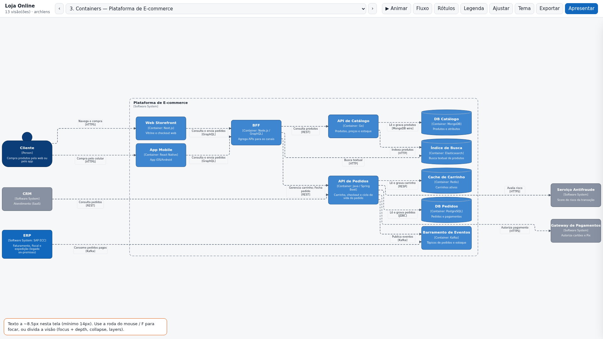
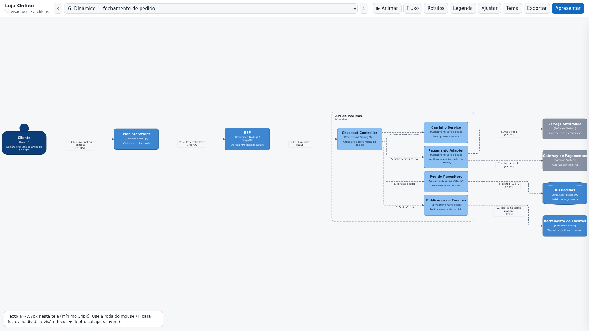
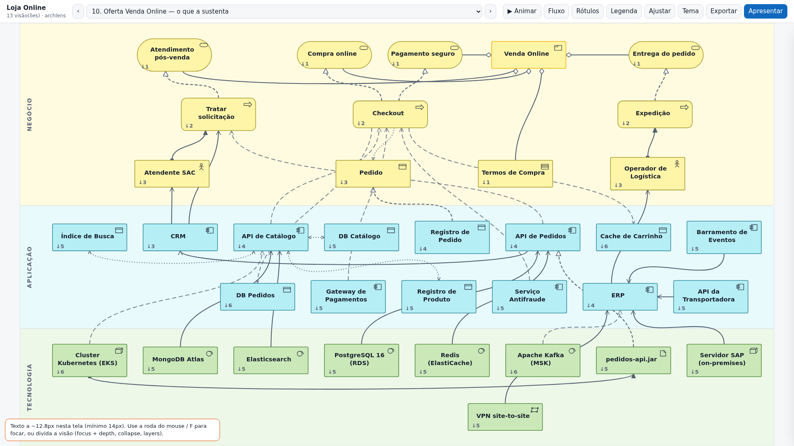
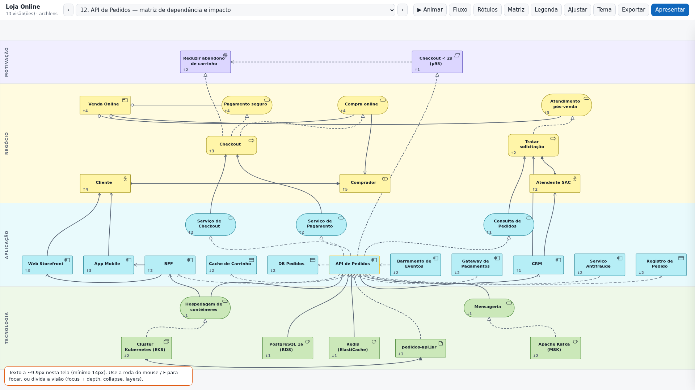
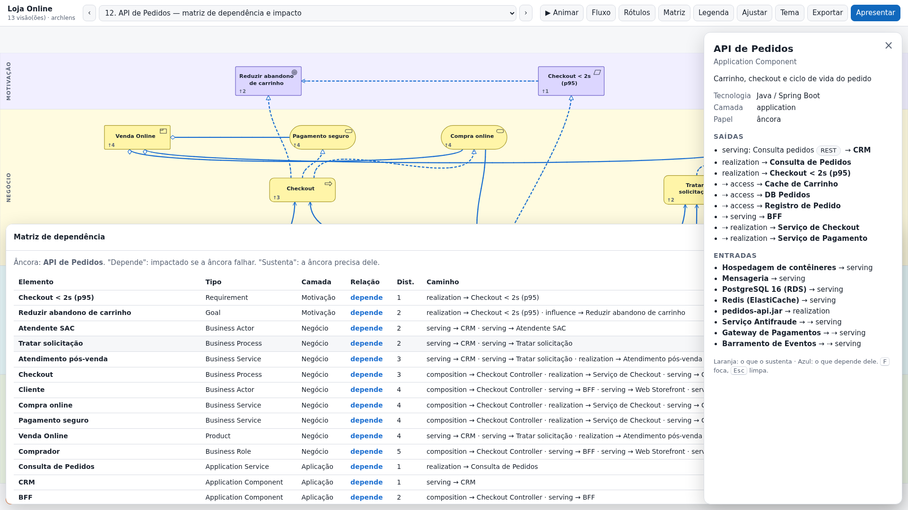
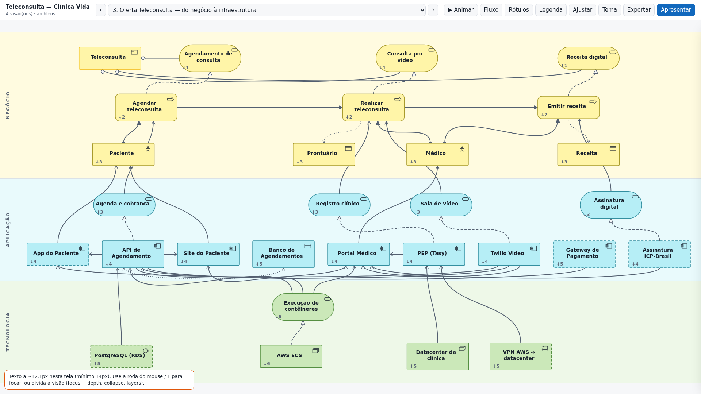

# Guia do archlens

O archlens transforma uma descrição de arquitetura (texto livre ou JSON) em uma **base de
conhecimento** (`ARCHITECTURE.md`) e extrai dela diagramas **C4** e **ArchiMate** em HTML animado,
feitos para apresentação em tela cheia.

- [Instalação](#instalação)
- [Usando com o Claude](#usando-com-o-claude)
- [Usando pela linha de comando](#usando-pela-linha-de-comando)
- [Apresentando](#apresentando)
- [Os cenários, com exemplos](#os-cenários-com-exemplos)
- [Problemas comuns](#problemas-comuns)

## Instalação

```bash
git clone <repo> ~/repos/github.com/expersoft/archlens
cd ~/repos/github.com/expersoft/archlens
npm install                    # playwright-core (opcional, para as checagens visuais)
npx playwright install chromium
ln -s "$PWD" ~/.claude/skills/archlens   # disponibiliza a skill no Claude Code
npm test
```

Requisitos: Node ≥ 18. O layout usa o ELK, já incluído em `scripts/vendor/` (licença EPL-2.0).
Sem o Chromium, tudo funciona, exceto os screenshots e a medição de largura e fonte do `deliver`.

## Usando com o Claude

A skill é acionada por pedidos como:

> Tenho esta arquitetura: *(texto)*. Gere o C4 de contexto e containers, e um ArchiMate com tudo que
> sustenta a oferta "Teleconsulta".

> A partir do `docs/ARCHITECTURE.md`, me mostre a matriz de impacto do ERP.

> Containers da plataforma, mas focando só na API de Pedidos e vizinhos.

> Quero a camada de tecnologia e, separado, o processo de Checkout com as aplicações e a infra que
> o suportam.

O Claude:

1. monta o `model.json` (marcando o que inferiu e anotando premissas);
2. valida;
3. escreve as visões pedidas;
4. roda `build`, que gera o `ARCHITECTURE.md`, o HTML e os screenshots;
5. lê o relatório de qualidade e divide visões grandes demais;
6. escreve a interpretação no documento.

Nas próximas conversas, basta apontar o `ARCHITECTURE.md` e pedir novas visões. O modelo não é refeito.

## Usando pela linha de comando

```bash
A="node scripts/archlens.mjs"
$A validate examples/loja-online/model.json
$A views    examples/loja-online/model.json            # visões definidas + sugestões
$A doc      examples/loja-online/model.json            # gera/atualiza ARCHITECTURE.md
$A build    examples/loja-online/model.json --out-dir out/
$A deliver  out/ARCHITECTURE.md --view impacto-api-pedidos --out out/impacto.html --open
$A deliver  out/ARCHITECTURE.md --spec '{"key":"erp","notation":"archimate","viewpoint":"impact","anchor":"erp"}' --out out/erp.html
$A resolve  model.json --view containers --json        # IR da visão (nós e arestas), para depuração
```

| Comando | O que faz |
|---|---|
| `validate` | erros (`E_*`) e avisos (`W_*`) com caminho e dica |
| `doc` | `ARCHITECTURE.md`, preservando blocos `keep` |
| `extract` | tira o JSON de dentro do `.md` |
| `views` | lista as visões definidas e sugere outras (contexto por sistema, suporte por produto, impacto por aplicação…) |
| `render` | HTML, sem checagem |
| `deliver` | HTML + screenshots 1920×1080 e 1280×720 + checagem de largura (≥ 90%) e fonte (≥ 14px). `--strict` não substitui a saída se falhar |
| `build` | `doc` + `deliver` de todas as visões |

Todos aceitam `model.json` ou `ARCHITECTURE.md`.

## Apresentando

O HTML é um arquivo único, sem dependências de rede. Cada visão ocupa 100% da largura: o SVG usa
só `viewBox`, e a altura se ajusta à proporção.

| Tecla | Ação |
|---|---|
| `←` `→` | visão anterior/próxima (como slides) |
| `P` | modo apresentação (tela cheia). A barra e o painel somem e voltam ao passar o mouse no topo ou na borda direita |
| `Espaço` | anima: C4 dinâmico toca os passos; ArchiMate com âncora pulsa por distância; visões de camada revelam faixa por faixa |
| clique num nó | destaca o que ele alcança (laranja) e o que chega até ele (azul); abre o painel de detalhes |
| `F` | enquadra o nó selecionado e seus vizinhos |
| `0` | ajusta à largura |
| roda / arrastar | zoom e pan (animando o `viewBox`, então o texto continua nítido) |
| `A` | partículas de fluxo nas relações |
| `R` | rótulos das relações ArchiMate |
| `M` | matriz de dependência (visões de impacto). Clicar numa linha destaca o elemento |
| `L` · `T` · `E` | legenda · tema claro/escuro · exportar SVG/PNG |
| duplo clique | abre a visão cujo scope/âncora é aquele nó (drill-down) |
| `?` | ajuda |

Se, no tamanho de tela atual, o texto cair abaixo de 14px, um aviso sugere zoom ou divisão da visão.

## Os cenários, com exemplos

Todos em `examples/loja-online/` (modelo em DSL) e `examples/telemedicina/` (modelo a partir de
texto livre: veja `entrada.md` e a seção *Premissas e inferências* do `ARCHITECTURE.md`).

### C4: nível e foco

`level` escolhe landscape, context, container, component ou dynamic. `focus` + `depth` recortam a
vizinhança, mesmo num modelo cheio de conexões. As relações declaradas entre componentes são elevadas
automaticamente ao nível da visão.




### ArchiMate: camadas e visões entre camadas

`viewpoint: business | application | technology` gera as visões de camada. `product-support` parte de
uma oferta e desce até a infraestrutura, organizando por camada:



`impact` sobre um application component traz tudo que depende dele (↑) e tudo que ele precisa (↓),
além da matriz:




A partir de texto livre (itens inferidos aparecem tracejados):



## Problemas comuns

| Sintoma | Causa provável |
|---|---|
| visão de suporte para no negócio | faltam `realization`/`serving` ligando containers a application services e estes a processos |
| visão C4 vazia ou só com o sistema | relações declaradas com `archimate:*` em vez de `uses` entre elementos C4 |
| `W_REL_DIRECTION` | serving/realization invertido (quem serve é a origem) |
| texto pequeno no telão | visão grande demais: use `focus`, `granularity:"container"`, `collapse` ou divida em várias visões |
| checagem visual pulada | faltam `npm install` e `npx playwright install chromium` |
