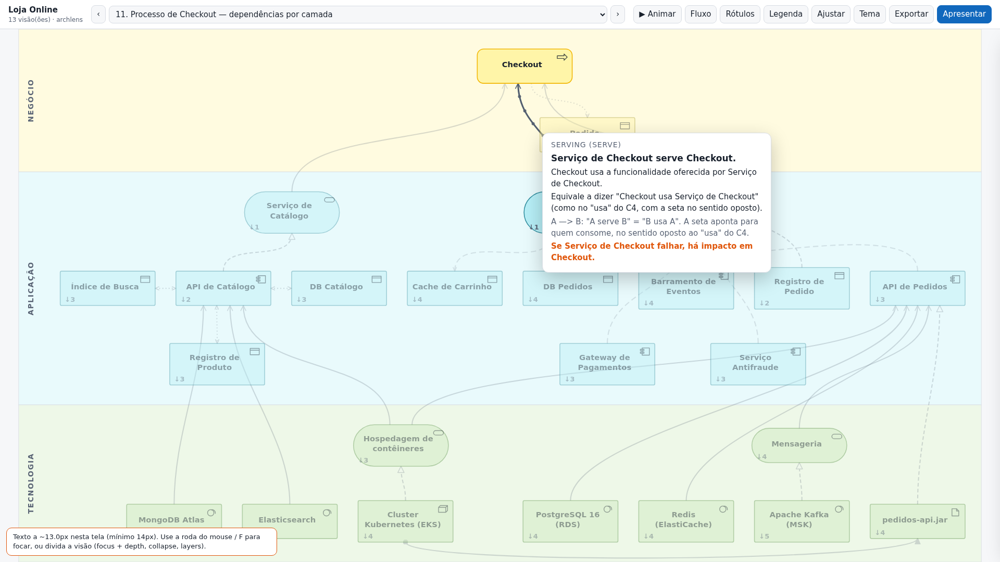
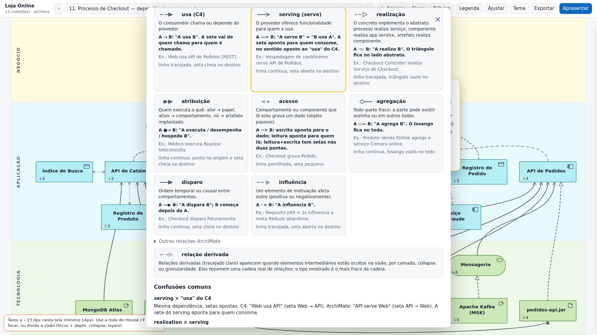
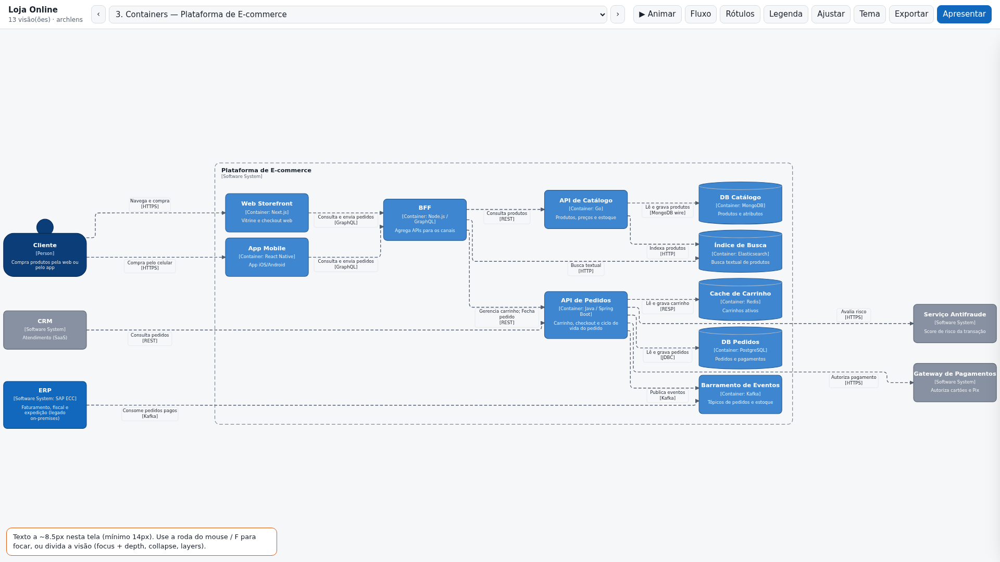
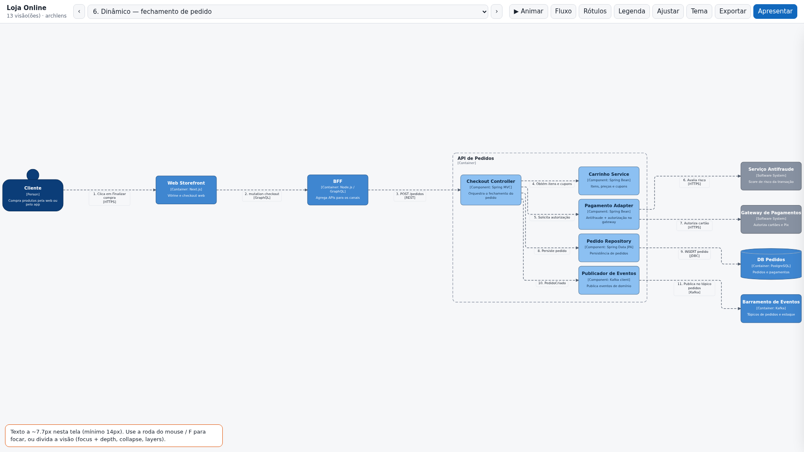
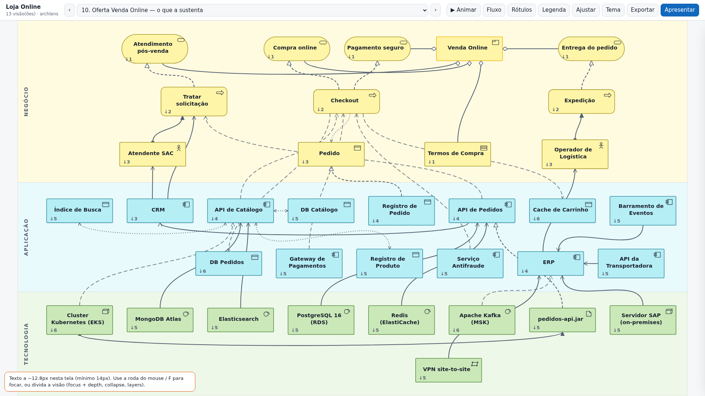
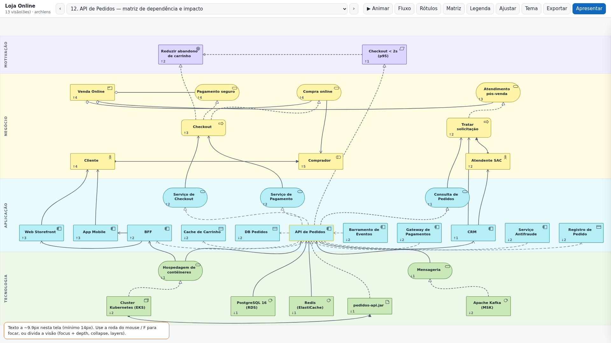
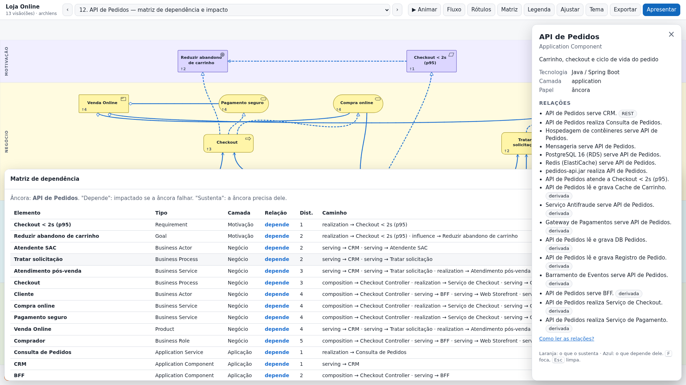
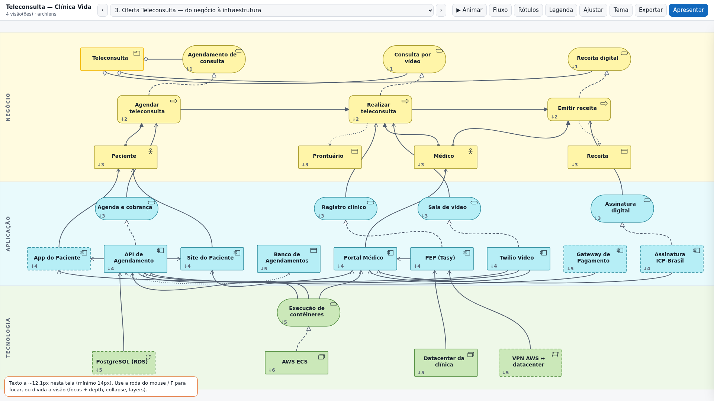

# Guia do archlens

O archlens transforma uma descrição de arquitetura (texto livre ou JSON) em uma **base de
conhecimento** (a pasta `architecture/` e o `ARCHITECTURE.md` gerado) e extrai dela diagramas **C4** e **ArchiMate** em HTML animado,
feitos para apresentação em tela cheia.

- [Instalação](#instalação)
- [Usando com o Claude](#usando-com-o-claude)
- [Evoluindo a base](#evoluindo-a-base)
- [Usando pela linha de comando](#usando-pela-linha-de-comando)
- [Apresentando](#apresentando)
- [Os cenários, com exemplos](#os-cenários-com-exemplos)
- [Problemas comuns](#problemas-comuns)

## Instalação

```bash
git clone <repo> ~/repos/github.com/expersoft/archlens
cd ~/repos/github.com/expersoft/archlens
npm install                    # playwright-core (opcional, para as checagens visuais)
npx playwright install chromium
ln -s "$PWD" ~/.claude/skills/archlens   # disponibiliza a skill no Claude Code
npm test
```

Requisitos: Node ≥ 18. O layout usa o ELK, já incluído em `scripts/vendor/` (licença EPL-2.0).
Sem o Chromium, tudo funciona, exceto os screenshots e a medição de largura e fonte do `deliver`.

## Usando com o Claude

**Onde a base mora.** O modelo fica na pasta `architecture/` (manifesto, `model.json`, `views.json`,
`changelog.json`, notas em `notes/`). O `ARCHITECTURE.md` é o documento legível gerado dela: não se edita; o texto
autoral vai em `architecture/notes/*.md`. `archlens check` confere se o documento está em dia (útil no CI) e
`archlens migrate` converte uma base antiga, com o modelo dentro do `.md`.

A skill é acionada por pedidos como:

> Tenho esta arquitetura: *(texto)*. Gere o C4 de contexto e containers, e um ArchiMate com tudo que
> sustenta a oferta "Teleconsulta".

> A partir da base em `docs/architecture/`, me mostre a matriz de impacto do ERP.

> Containers da plataforma, mas focando só na API de Pedidos e vizinhos.

> Quero a camada de tecnologia e, separado, o processo de Checkout com as aplicações e a infra que
> o suportam.

O Claude:

1. monta um delta (marcando o que inferiu e anotando premissas) e roda o merge, perguntando o que for conflito
   (a validação acontece dentro do merge: um plano com erros sai bloqueado e o apply não grava nada inválido);
2. escreve as visões pedidas;
3. roda `build`, que regenera o `ARCHITECTURE.md` e gera o HTML (em `architecture/diagrams/`) e os screenshots;
4. lê o relatório de qualidade e divide visões grandes demais;
5. escreve a interpretação em `architecture/notes/`.

Nas próximas conversas, basta apontar a pasta `architecture/` e pedir novas visões. O modelo não é refeito.

## Evoluindo a base

A base cresce por rodadas. A cada informação nova, diga ao Claude o que mudou:

> O PEP Tasy vai ser substituído por um PEP em nuvem até março. Atualize a base.

> A API de Pedidos agora é Kotlin, e existe um worker novo que consome o tópico de pedidos.

O Claude escreve um **delta**, roda `archlens merge … --plan`, mostra o que é novo e pergunta, **um item por vez**,
só o que exige decisão: conflitos ("a base diz Java, você disse Kotlin"), possíveis duplicatas ("'API Agendamento' é
a mesma 'API de Agendamento'?"), remoções e desativações. Depois aplica, e o `ARCHITECTURE.md` ganha:

- a coluna **Fontes** e a seção **Fontes** (de onde veio cada fato);
- a seção **Ciclo de vida** (`planned`, `deprecated`, `retired`) e visões as-is/to-be;
- a seção **Histórico** com a rodada, e um commit sugerido.

Pela linha de comando:

```bash
$A merge architecture/ delta.json --plan plano.json   # relatório + plano com as perguntas
# responda primeiro as possíveis duplicatas (same | different); se alguma for "same", replaneje com as respostas:
$A merge architecture/ delta.json --plan plano2.json --answers plano.json
# edite "resolution" nos itens pendentes: keep | take | value:<x> | same | different | yes | no
$A merge architecture/ --apply plano2.json           # grava, regenera e registra
```

Aplicar de novo um delta que já entrou não muda nada: o apply imprime `= nada mudou; a base não foi regravada`.

Veja `examples/telemedicina/delta-01.json` e `plano-01.json`, e o formato completo em `references/merge.md`.

### Vendo antes de aplicar

Peça "mostre como fica" e o Claude gera a **prévia** do delta: a base oficial desenhada normalmente e, por
cima, o que muda — novo em esboço com `+`, alterado com `~`, removido riscado com `−`, decisão pendente com `?`.
Nada é gravado; responda as perguntas, veja a prévia de novo com `--plan` e só então aplique. Exemplo:
`examples/telemedicina/delta-02.json` e `examples/telemedicina/architecture/diagrams/delta-02-preview.html`.

Itens ainda em discussão podem entrar na base com `status: "draft"`: aparecem em esboço, sem marcador.

## Usando pela linha de comando

```bash
A="node scripts/archlens.mjs"
$A validate examples/loja-online/architecture
$A views    examples/loja-online/architecture               # visões definidas + sugestões
$A doc      examples/loja-online/architecture               # regenera o ARCHITECTURE.md
$A build    examples/loja-online/architecture
$A check    examples/loja-online/architecture               # modelo válido e ARCHITECTURE.md em dia (CI)
$A migrate  ARCHITECTURE.md                                 # formato antigo → architecture/
$A deliver  examples/loja-online/architecture --view impacto-api-pedidos --out out/impacto.html --open
$A deliver  examples/loja-online/architecture --spec '{"key":"erp","notation":"archimate","viewpoint":"impact","anchor":"erp"}' --out out/erp.html
$A resolve  architecture/ --view containers --json        # IR da visão (nós e arestas), para depuração
```

| Comando | O que faz |
|---|---|
| `validate` | erros (`E_*`) e avisos (`W_*`) com caminho e dica |
| `doc` | regenera o `ARCHITECTURE.md` a partir da pasta |
| `migrate` | converte uma base antiga (modelo dentro do `.md`) para `architecture/` e confere que o modelo é idêntico |
| `check` | valida o modelo e confere se o `ARCHITECTURE.md` está em dia; código 1 se não (CI, pre-commit) |
| `extract` | imprime o modelo canônico (JSON) da base |
| `views` | lista as visões definidas e sugere outras (contexto por sistema, suporte por produto, impacto por aplicação…) |
| `render` | HTML, sem checagem |
| `deliver` | HTML + screenshots 1920×1080 e 1280×720 + checagem de largura (≥ 90%) e fonte (≥ 14px). `--strict` não substitui a saída se falhar |
| `build` | `doc` + `deliver` de todas as visões |
| `merge … --plan p.json [--answers antigo.json]` | compara um delta com a base e grava o plano com as perguntas; `--answers` reaproveita as respostas de um plano anterior |
| `merge … --apply p.json` | aplica o plano respondido: valida, grava `architecture/`, regenera o `ARCHITECTURE.md` e registra o histórico |

Todos aceitam a pasta, o `ARCHITECTURE.md` gerado ou nada (procura a partir do diretório atual); bases antigas
são só lidas até o `migrate`. O `migrate` é a exceção: recebe o `.md` antigo ou um `model.json`.

## Apresentando

O HTML é um arquivo único, sem dependências de rede. Cada visão ocupa 100% da largura: o SVG usa
só `viewBox`, e a altura se ajusta à proporção.

| Tecla | Ação |
|---|---|
| `←` `→` | visão anterior/próxima (como slides) |
| `P` | modo apresentação (tela cheia). A barra e o painel somem e voltam ao passar o mouse no topo ou na borda direita |
| `Espaço` | anima: C4 dinâmico toca os passos; ArchiMate com âncora pulsa por distância; visões de camada revelam faixa por faixa |
| passar o mouse num nó | prévia: acende o nó e os vizinhos diretos, com partículas nas relações dele; o cartão lista as relações em português |
| passar o mouse numa relação | cartão explicando a relação: frase, significado, como ler a seta e impacto |
| clique numa relação | fixa o cartão, com link para o glossário daquele tipo |
| clique num nó | trace completo: o que ele alcança/o sustenta (laranja) e o que chega até ele/depende dele (azul); abre o painel de detalhes |
| `F` | enquadra o nó selecionado e seus vizinhos |
| `0` | ajusta à largura |
| roda / arrastar | zoom e pan (animando o `viewBox`, então o texto continua nítido) |
| `A` | partículas de fluxo nas relações |
| `R` | rótulos das relações ArchiMate |
| `M` | matriz de dependência (visões de impacto). Clicar numa linha destaca o elemento |
| `L` · `G` · `T` · `E` | legenda (com as setas reais) · glossário de relações · tema claro/escuro · exportar SVG/PNG |
| duplo clique | abre a visão cujo scope/âncora é aquele nó (drill-down) |
| `?` | ajuda |

Se, no tamanho de tela atual, o texto cair abaixo de 14px, um aviso sugere zoom ou divisão da visão.

### Entendendo as relações

Algumas relações ArchiMate confundem quem vem do C4. A mais comum é o **serving**, cuja seta aponta
para quem **consome**, no sentido oposto do "usa" do C4. Por isso cada relação traz uma explicação
gerada a partir do modelo, por exemplo:

> **Hospedagem de contêineres serve API de Pedidos.** API de Pedidos usa a funcionalidade oferecida
> por Hospedagem de contêineres. Equivale a dizer "API de Pedidos usa Hospedagem de contêineres".
> *Se Hospedagem de contêineres falhar, há impacto em API de Pedidos.*

A explicação aparece:

- no cartão de hover;
- no painel lateral, onde as relações do elemento são listadas como frases;
- no glossário (`G`), que traz cada tipo com a seta desenhada, a forma de ler, um exemplo e as
  confusões comuns: serving × usa, realization × serving, direção do access, agregação × composição.




## Os cenários, com exemplos

Todos em `examples/loja-online/` (modelo em DSL) e `examples/telemedicina/` (modelo a partir de
texto livre: veja `entrada.md` e a seção *Premissas e inferências* do `ARCHITECTURE.md`).

### C4: nível e foco

`level` escolhe landscape, context, container, component ou dynamic. `focus` + `depth` recortam a
vizinhança, mesmo num modelo cheio de conexões. As relações declaradas entre componentes são elevadas
automaticamente ao nível da visão.




### ArchiMate: camadas e visões entre camadas

`viewpoint: business | application | technology` gera as visões de camada. `product-support` parte de
uma oferta e desce até a infraestrutura, organizando por camada:



`impact` sobre um application component traz tudo que depende dele (↑) e tudo que ele precisa (↓),
além da matriz:




A partir de texto livre (itens inferidos aparecem tracejados):



## Problemas comuns

| Sintoma | Causa provável |
|---|---|
| visão de suporte para no negócio | faltam `realization`/`serving` ligando containers a application services e estes a processos |
| visão C4 vazia ou só com o sistema | relações declaradas com `archimate:*` em vez de `uses` entre elementos C4 |
| `W_REL_DIRECTION` | serving/realization invertido (quem serve é a origem) |
| texto pequeno no telão | visão grande demais: use `focus`, `granularity:"container"`, `collapse` ou divida em várias visões |
| checagem visual pulada | faltam `npm install` e `npx playwright install chromium` |
